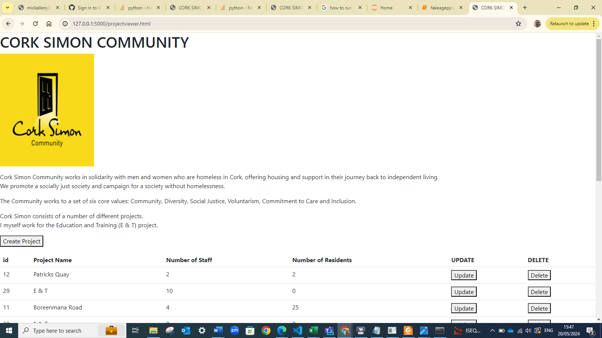
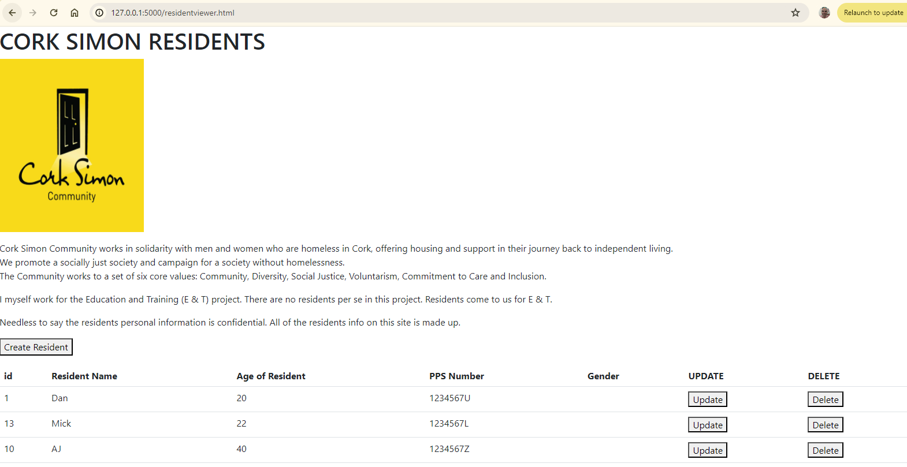
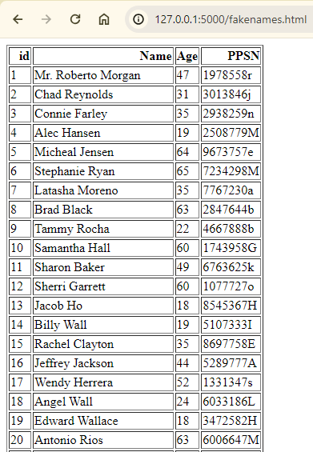
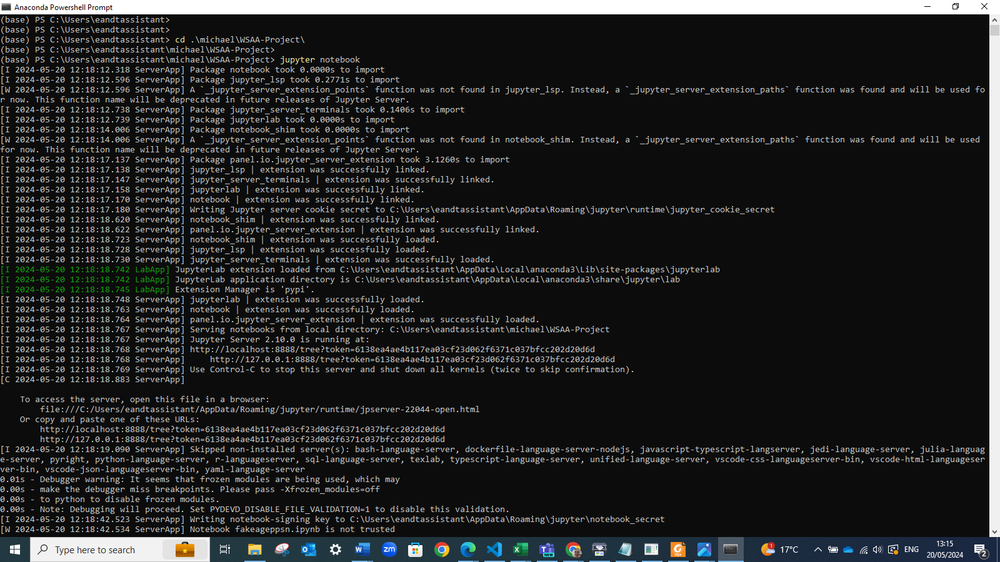
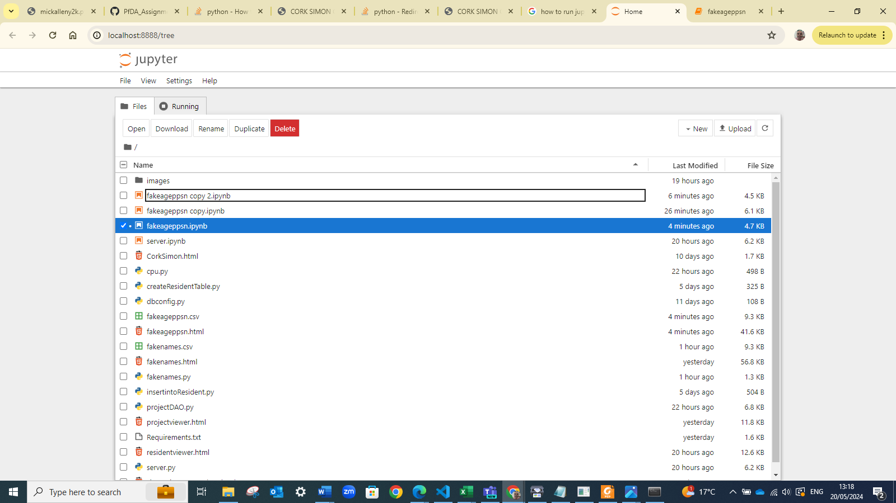
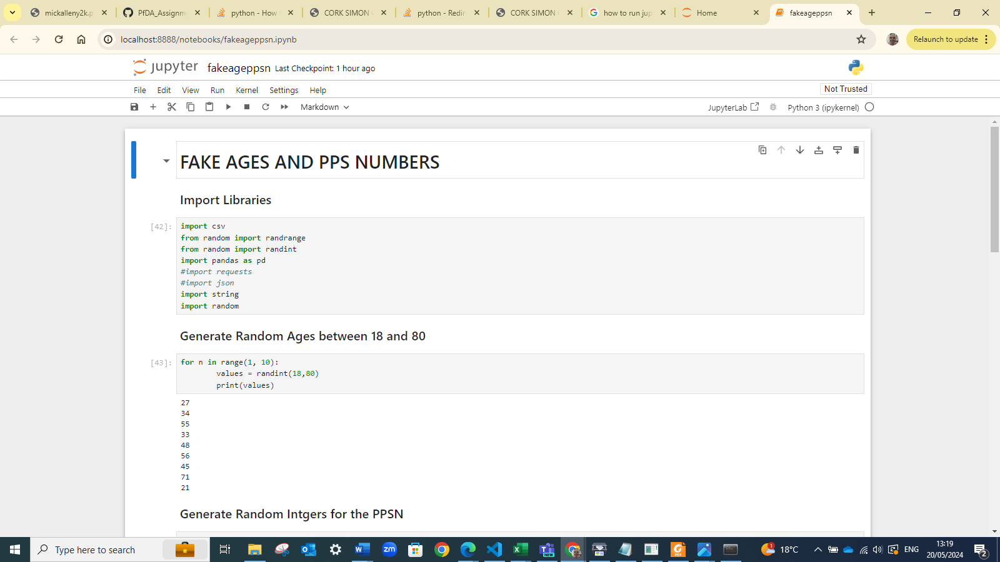

# Web Services and Applications(WSAA) Project

## Web App
Here are the links to my web app: 
- https://mickalleny2k.pythonanywhere.com
- https://mickalleny2k.pythonanywhere.com/projectviewer.html
- https://mickalleny2k.pythonanywhere.com/residentviewer.html
- https://mickalleny2k.pythonanywhere.com/fakenames.html
- https://mickalleny2k.pythonanywhere.com/project
- https://mickalleny2k.pythonanywhere.com/project/9
- https://mickalleny2k.pythonanywhere.com/project/totalstaff
- https://mickalleny2k.pythonanywhere.com/project/count
- https://mickalleny2k.pythonanywhere.com/resident
- https://mickalleny2k.pythonanywhere.com/resident/Joe
- https://mickalleny2k.pythonanywhere.com/resident/3
- https://mickalleny2k.pythonanywhere.com/resident/count
- https://mickalleny2k.pythonanywhere.com/resident/avgage

## Introduction :
Write a program that demonstrates that you understand creating and consuming RESTful APIs

## Purpose of Task :
Create a Web application in Flask that has a RESTful API, the application should link to one or more database tables.
Also create the web pages that can consume the API. I.e. performs CRUD operations on the data.

## Installation :
Run the python program server.py in Visual Studio Code

Click on the link : http://127.0.0.1:5000

A web browser should open up.

The projectviewer.html page lists all of the Cork Simon projects. The user can create, update and delete projects.

The residentviewer.html page lists all of the Cork Simon residents. The user can create, update and delete residents.

The fakenames.html lists the id, name, age and PPSN of the Cork Simon residents. Needless to say the residents personal information is confidential. All of the residents info on this site is made up. I used the following libraries to make up resident info: faker, random and string.

## Requirements :
I ran the following command : pip freeze > Requirements.txt
Please refer to Requirements.txt

## Jupyter Notebook
Run the command  jupyter notebook in Anaconda console

Jupyter Notebook should connect to the localhost and a web browser should automatically open up.

Open the notebook fakeageppsn.ipynb

## ISSUES
### Troubleshooting cloning errors

https://docs.github.com/en/repositories/creating-and-managing-repositories/troubleshooting-cloning-errors

If you're having trouble cloning a repository, check these common errors.
1. HTTPS cloning errors
 - Check your Git version
 - Ensure the remote is correct
 - Provide an access token
 - Check your permissions
 - Use SSH instead
 
 2. Error: Repository not found
  - Check your spelling
  - Checking your permissions
  - Check your SSH access
  - Check that the repository really exists
  
 3. Error: Remote HEAD refers to nonexistent ref, unable to checkout

