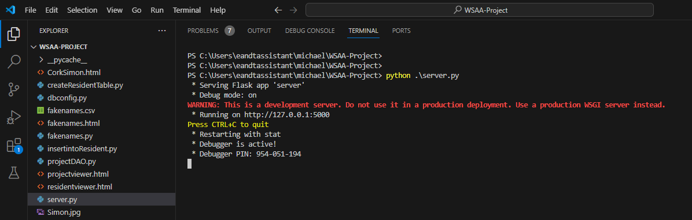
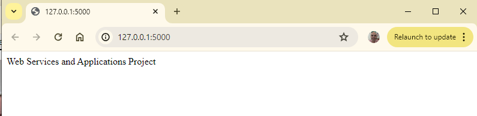
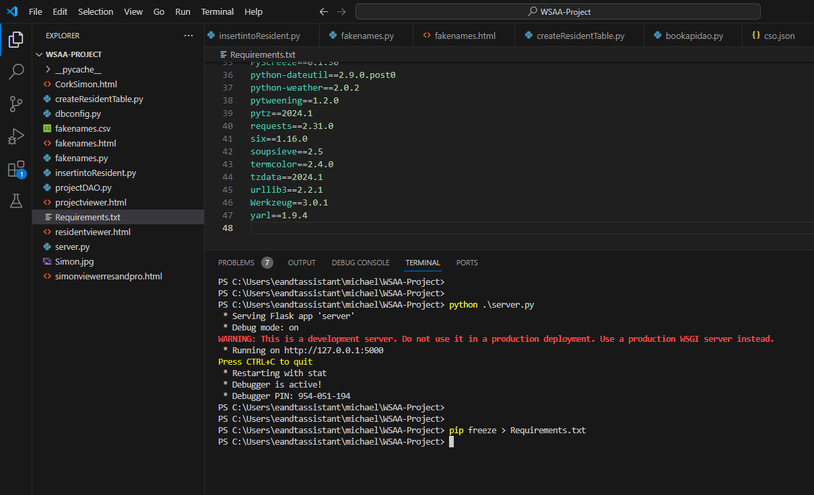

# WSAA-Project

## Web App
Here are the links to my web app: 
- https://mickalleny2k.pythonanywhere.com
- https://mickalleny2k.pythonanywhere.com/projectviewer.html
- https://mickalleny2k.pythonanywhere.com/residentviewer.html
- https://mickalleny2k.pythonanywhere.com/fakenames.html
- https://mickalleny2k.pythonanywhere.com/project
- https://mickalleny2k.pythonanywhere.com/project/9
- https://mickalleny2k.pythonanywhere.com/project/totalstaff
- https://mickalleny2k.pythonanywhere.com/project/count
- https://mickalleny2k.pythonanywhere.com/resident
- https://mickalleny2k.pythonanywhere.com/resident/Joe
- https://mickalleny2k.pythonanywhere.com/resident/3
- https://mickalleny2k.pythonanywhere.com/resident/count
- https://mickalleny2k.pythonanywhere.com/resident/avgage

## Introduction :
Write a program that demonstrates that you understand creating and consuming RESTful APIs

## Purpose of Task :
Create a Web application in Flask that has a RESTful API, the application should link to one or more database tables.
Also create the web pages that can consume the API. I.e. performs CRUD operations on the data.

## Installation :
Run the python program server.py in Visual Studio Code

Click on the link : http://127.0.0.1:5000

A web browser should open up.

## Requirements :
I ran the following command : pip freeze > Requirements.txt
Please refer to Requirements.txt

